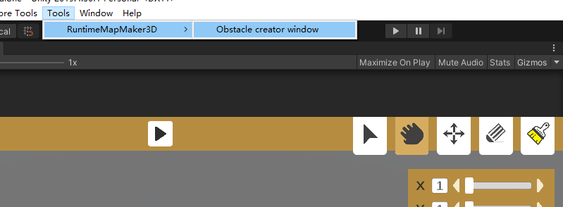
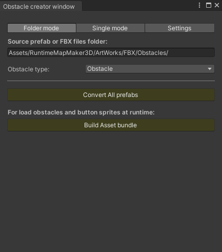
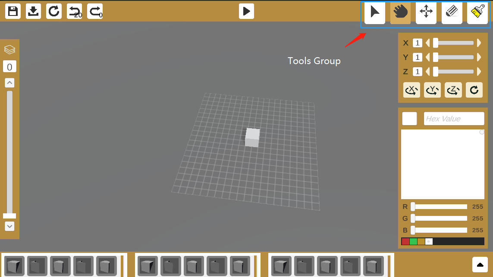
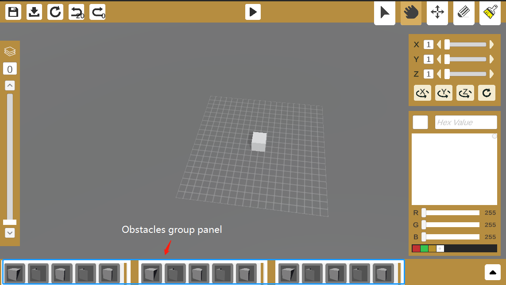
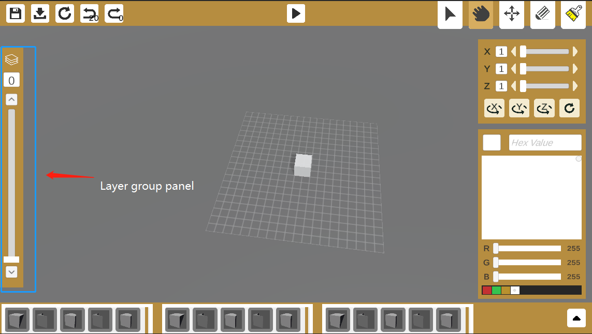
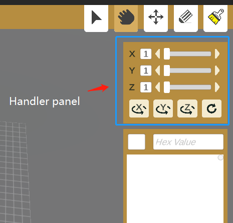

## Welcome to the “Runtime Map Maker 3D” . 
V1.0.0

Copyright (c) LouYaoMing. All Right Reserved.
Licensed under the MIT License.

&emsp; "Runtime Map Maker 3D"is a plugin for custom building maps during Unity runtime. It allows your game to have the function of customizing the map at runtime, and helps players develop their inspiration in your game.

&emsp; The plug-in has a highly configurable plot size and construction prefabricated units. Through the RMM3D settings window, you can easily convert your prefab into RMM3D prefabricated units.

&emsp; Note that the script object of the plugin is currently managed by Zenject dependency injection. If you are not familiar with dependency injection, please refer to Zenject. But dependency injection does not affect the coding of your main game.

Dependence:
- Extenject Dependency Injection IOC
- JsonDotNet
- TextMesh Pro
- HSVPicker  https://github.com/judah4/HSV-Color-Picker-Unity
- RuntimeTransformHandle  https://github.com/pshtif/RuntimeTransformHandle

Thanks to all of you guys. 

Features:
- Snapping from the 3D grid
- Brush placement
- Area Selection
- Move selected
- Brush Deletion
- Area Deletion
- Change Y axis Base
- Save/Load 
- Undo/Redo all of action
- Auto generate item preview image 

## Nomenclature:
Obstacle: The prefab units you edit/build in RMM3D at unity runtime.

SourcePrefab: The source prefab/FBX you want to convert to Obstacle.

## On editor mode:

1.Open “Tools/RuntimeMapMaker3D/Obstacle creator window”.
2.Build Asset bundle, at “Obstacle creator window”.
3.Now, you can join it.

On play mode:
- At persistent group panel:
You can save, load, reset, undo, redo your design.

- At tools group panel:
You can Brush/Select/Delete/Move your obstacle

- At obstacle group panel:
You can select different type of obstacle.

- At layer group panel:
You can brush obstacle at different y axis.

- Handler panel
You can resize handler size, and rotate handler.

